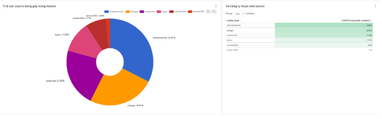
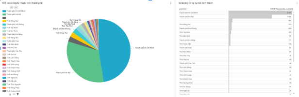
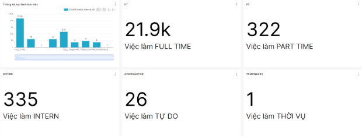
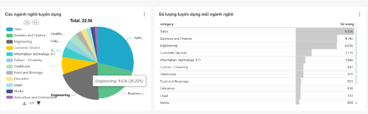

# DATN - Hệ thống thu thập và xử lý dữ liệu việc làm đa nguồn

## Giới thiệu

Repository này xây dựng một hệ thống tự động thu thập, xử lý và chuẩn hóa dữ liệu tuyển dụng từ nhiều website việc làm lớn tại Việt Nam. Mục tiêu là xây dựng một kho dữ liệu lớn, đồng nhất và chất lượng, phục vụ các bài toán phân tích thị trường lao động, nghiên cứu nhu cầu tuyển dụng, hoặc làm nền tảng cho các ứng dụng AI/Data Science về ngành nhân sự.

## Chức năng chính

- **Thu thập dữ liệu tuyển dụng và công ty**:  
  - Sử dụng nhiều crawler (Scrapy spider) để tự động lấy tin tuyển dụng, thông tin doanh nghiệp từ các website lớn như: VietnamWorks, Vieclam24h, TopCV, CareerViet, Timviec365, CareerLink, JobsGo...
  - Hỗ trợ crawl cả thông tin job lẫn thông tin công ty, nhận diện doanh nghiệp và chuẩn hóa tên doanh nghiệp giữa các nguồn khác nhau.

- **Tự động hóa pipeline thu thập và xử lý**:  
  - Sử dụng Apache Airflow để định nghĩa các DAG (Directed Acyclic Graph) tự động hóa toàn bộ quy trình crawling, xử lý, chuẩn hóa, phân tích và lưu trữ dữ liệu.
  - Mỗi DAG tương ứng một nguồn dữ liệu hoặc một pipeline riêng biệt, dễ dàng mở rộng thêm nguồn mới.
  - Hỗ trợ lên lịch thu thập định kỳ và kiểm soát luồng dữ liệu.

- **Làm sạch và chuẩn hóa dữ liệu**:  
  - Module chuẩn hóa tên công ty (`normalize_company_name.py`), chuẩn hóa địa chỉ, loại bỏ tiền tố/hậu tố, gộp các bản ghi trùng lặp.
  - Chuẩn hóa thông tin mô tả công việc, loại hình hợp đồng, lương, phúc lợi, kỹ năng, địa chỉ... sang các trường dữ liệu thống nhất.
  - Tăng khả năng matching và phân tích chéo dữ liệu giữa các nguồn khác nhau.

- **Xử lý và lưu trữ dữ liệu lớn**:  
  - Sử dụng Spark cho các tác vụ xử lý dữ liệu lớn, chuyển đổi định dạng, trích xuất thông tin quan trọng.
  - Lưu trữ kết quả crawling dưới dạng Parquet, upload lên MinIO hoặc các hệ lưu trữ dữ liệu lớn khác.
  - Hỗ trợ tích hợp với hệ phân tích dữ liệu (Trino, Presto...) để truy vấn dữ liệu hiệu quả.

- **Khả năng mở rộng và tích hợp**:  
  - Dễ dàng thêm nguồn dữ liệu mới bằng cách xây dựng spider và DAG tương ứng.
  - Có thể tích hợp thêm các bước phân tích AI, trích xuất thông tin nâng cao, hoặc các API phục vụ ứng dụng ngoài.

## Kiến trúc tổng thể

- **Cấu trúc thư mục chính:**
  - `crawler/`: Chứa các spider thu thập dữ liệu từ từng website, các module nhận diện và chuẩn hóa công ty.
  - `dags/`: Các DAG Airflow định nghĩa pipeline crawling & xử lý cho từng nguồn.
  - `utils/`, `scripts/`: Các hàm tiện ích, xử lý logic chung.
  - `docker/`, `Dockerfile`: Môi trường chạy Airflow, Spark, MinIO, Trino...

- **Luồng hoạt động:**
  1. Khởi động DAG Airflow tương ứng với nguồn dữ liệu.
  2. Tiến hành crawl dữ liệu job/company bằng Scrapy spider.
  3. Làm sạch, chuẩn hóa & xử lý dữ liệu bằng Spark và các module Python.
  4. Lưu trữ kết quả lên MinIO & định dạng Parquet phục vụ truy vấn lớn.
  5. Sẵn sàng cho truy vấn phân tích (Trino/Presto) hoặc xuất ra các hệ thống khác.

## Ứng dụng

- Nghiên cứu thị trường lao động, phân tích xu hướng tuyển dụng.
- Huấn luyện mô hình AI về tuyển dụng, gợi ý việc làm, phân tích năng lực thị trường.
- Xây dựng hệ thống tìm kiếm việc làm, dashboard quản trị nhân sự, báo cáo thị trường cho doanh nghiệp.

## Trực quan hóa dữ liệu:
- Dưới đây là 4 trong số nhiều chart được tạo ra sau quá trình làm giàu, xử lý dữ liệu:

| Giai đoạn                | Thời gian trung bình           | Hiệu năng / Đặc điểm                                             |
|--------------------------|-------------------------------|------------------------------------------------------------------|
| Crawl dữ liệu            | 8–12 phút / website           | Tốc độ phụ thuộc độ sâu trang và số lượng tin                   |
| Xử lý & chuẩn hóa (Spark)| 3 phút / 50.000 bản ghi       | Tốc độ ổn định, có thể mở rộng theo node                        |
| Identify trùng lặp       | 2 phút / 10.000 bản ghi       | Tỷ lệ phát hiện trùng ~9–10%                                    |
| Phân loại LLM (DeepSeek) | 1.2 giây / bản ghi           | Độ chính xác trung bình 90%                                     |
| Truy vấn dữ liệu (Trino) | 3 giây / truy vấn đơn giản    | Có thể mở rộng lên nhiều worker                                 |
| Render dashboard (Superset) | 1–2 giây                   | Phụ thuộc vào kích thước dataset                                |

